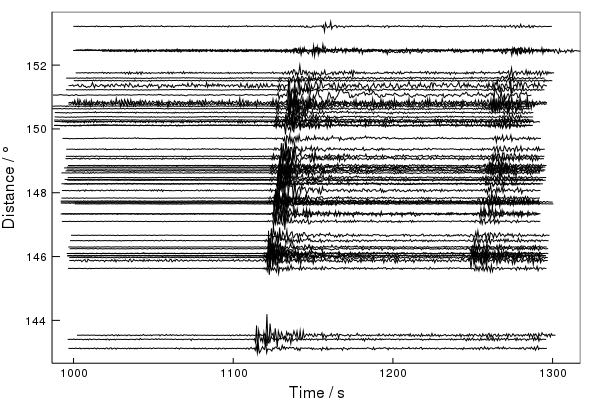

# Seis.jl

[](https://travis-ci.org/anowacki/Seis.jl)
[](https://coveralls.io/github/anowacki/Seis.jl?branch=master)


Seis.jl is an open, fast and flexible framework for analysing seismic
data in [Julia](https://julialang.org).

## Current state of Seis.jl

Right now we are asking the passive seismic community what they want in a
package; see the [draft specification document](https://github.com/anowacki/Seis.jl/blob/master/Seis.jl.md) for
more detail.

Whilst this is happening, this package is being developed and is a
trial implementation of the core
functionality which we think is needed.  Although the package is extensively
tested, please note that in this phase the public interface is subject to
change at any time.

Because things may change, documentation is also extremely limited.  All
public functions have extensive docstrings, however, and PRs to clarify
any problems with these are always welcome.

One way to explore the package until  documentation is ready is via
the REPL.  After `using Seis`, type `Seis.` and hit tab a couple of
times to see what Seis defines.

## Installation

At present, Seis is unregistered and it and its dependencies must be
installed manually.  This will change once Seis is registered in
the General registry.

To install Seis, do:

```julia
julia> ] # As soon as you press ']', you enter Pkg mode...

(v1.3) pkg> add https://github.com/anowacki/Geodesics.jl https://github.com/anowacki/SAC.jl https://github.com/anowacki/Seis.jl
```

## Basic introduction

`Seis` is based around single traces of evenly-sampled continuous data where
time is the independent variable.  (In future we may support unevenly-sampled
data and traces with gaps, and we plan to soon support frequency-domain traces.)
Each trace holds its sampling interval (the property `.delta`) and a start time
(`.b`).  Traces have the type `Trace`.

`Trace`s also optionally hold information about the event (`.evt`) and station
(`.sta`) associated with this recording.  `Event`s and `Station`s are the
corresponding types, which also contain useful properties.

For more information, see the docstrings for `Trace`, `Event` and `Station`.
This is easily done in the Julia REPL like so:

```julia
julia> using Seis

julia> ? # As soon as you press '?', the prompt changes to 'help?>'

help?> Trace
search: Trace trace backtrace AbstractSet AbstractVector AbstractVecOrMat

  Trace

  Evenly-sampled time series recorded at a single seismic station. The start
  time of the trace, in s, is in the b field, whilst the sampling interval, in
  s, is delta. The trace itself is accessed using the trace method, like
  trace(t).

  [...]
```

All three types above also hold a `.meta` property, which contains any extra
metadata you want to associate with the trace, event or station.

## Common conventions

### `f` vs `f!`
`Trace`s are `mutable struct`s, and therefore for all functions which
potentially modify a trace, there are two versions.  Firstly, an in-place
function (e.g., `bandpass!`) which as per Julia convention ends with an
exclamation mark, and modifies the trace.  Secondly, for convenience, there
is always a copying version without the exclamation mark (e.g., `bandpass`)
which returns a modified copy of the input trace.

### Arrays of traces
There is no special type for holding multiple traces.  Instead, we operate
on arrays of traces.  For instance, reading multiple traces from the same
event, we can access all the station names like so:

```julia
julia> t = sample_data(:array);

julia> t.sta.sta
60-element Array{String,1}:
 "ABA"
 "APA"
 "AWI"
 "BBH"
 "BBO"
 "BDL"
 "BTA"
 "BWH"
 "CRA"
 "CSF"
 "EAB"
 "EAU"
 "EBH"
 ⋮    
 "PMS"
 "TSA"
 "WAL"
 "WCB"
 "WME"
 "WPM"
 "XAL"
 "XDE"
 "YEL"
 "YLL"
 "YRC"
 "YRE"
```

Or to get the full channel code from available header information:

```julia
julia> channel_code.(t)
60-element Array{String,1}:
 ".ABA..SHZ"
 ".APA..SHZ"
 ".AWI..SHZ"
 ".BBH..SHZ"
 ".BBO..SHZ"
 ".BDL..SHZ"
 ".BTA..SHZ"
 ".BWH..SHZ"
 ".CRA..SHZ"
 ".CSF..SHZ"
 ".EAB..SHZ"
 ".EAU..SHZ"
 ".EBH..SHZ"
 ⋮          
 ".PMS..SHZ"
 ".TSA..SHZ"
 ".WAL..SHZ"
 ".WCB..SHZ"
 ".WME..SHZ"
 ".WPM..SHZ"
 ".XAL..SHZ"
 ".XDE..SHZ"
 ".YEL..SHZ"
 ".YLL..SHZ"
 ".YRC..SHZ"
 ".YRE..SHZ"
```

Note the use of the broadcasted `.` operation (`channel_code.(t)`) which applied
the 'scalar' function (`channel_code`) to each trace in the array `t`.

## IO

Currently, only SAC data are read or written, but may be either bigendian
(SAC/BRIS convention) or little-endian (usual IRIS SAC convention).

Use the `read_sac` and `write_sac` functions for SAC-formatted IO.

Future work will add support for reading many more formats and format
auto-detection.

## Plotting

At present, some basic plotting is available when `using Plots`.
It makes use of [RecipesBase.jl](https://github.com/JuliaPlots/RecipesBase.jl)
so that if you do not need plotting, the package does not introduce this
dependency.  If you do want plots, simply install [Plots.jl](https://github.com/JuliaPlots/Plots.jl)
by `import Pkg; Pkg.add("Plots")`.  You then need to do `using Plots` when you
want to start using Seis.jl's plotting routines.

By default,
plotting functionality is not exported, so you must also do `using Seis.Plot`
before the routines `plot` (plots traces) and `section` (plot record sections)
are available.

As an example:

```julia
julia> using Seis, Seis.Plot, Plots

julia> t = sample_data(:array);

julia> section(t)
```

produces:



See the help for the `Seis.Plot` module for more information.

## Basic processing

Basic time series processing of traces is possible using functions such as
`integrate`, `bandpass`, `remove_trend`.  Until proper documentation is
ready, see the exported functions in `src/Seis.jl` for the full list.

## Maintainers

At present, [Andy Nowacki](mailto:a.nowacki@leeds.ac.uk) (@anowacki) is
the primary maintainer of Seis.jl.
